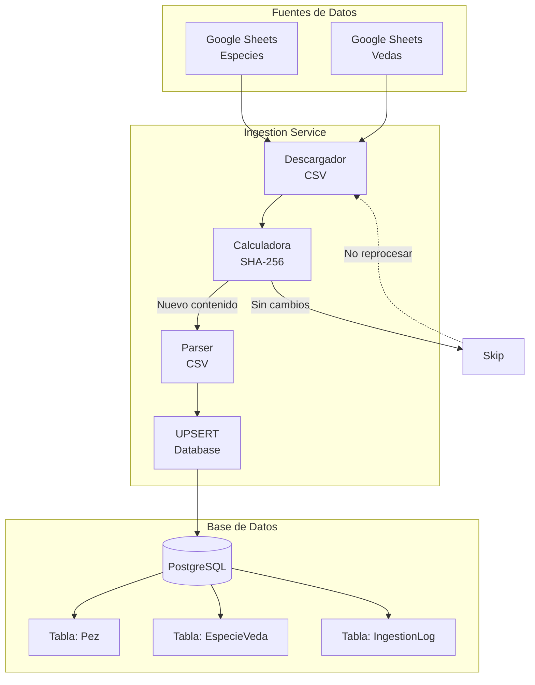

# API Pesca Yucatán

> REST API para gestión de temporadas de veda y especies marinas en Yucatán, México.

API desarrollada con Spring Boot 3.5 para consultar y gestionar información sobre especies de pesca y sus temporadas de veda en la región peninsular.

## Características

- **Gestión de Especies**: Catálogo de especies marinas con información técnica (talla mínima, habitat, técnicas de pesca)
- **Temporadas de Veda**: Control de períodos de veda por especie y zona geográfica
- **Pipeline de Ingesta Automatizado**: Sincronización automática desde Google Sheets

## Pipeline de Ingesta de Datos



### Flujo de Datos

| Etapa | Descripción |
|-------|-------------|
| **Descarga** | Obtiene CSVs desde Google Sheets vía HTTP |
| **Deduplicación** | Calcula SHA-256 del contenido para evitar reprocesamiento |
| **Parsing** | Convierte CSV a objetos Java (EspecieCsvRow, VedaCsvRow) |
| **Upsert** | Inserta o actualiza registros en PostgreSQL |
| **Logging** | Registra resultado en IngestionLog |

### Configuración

```properties
ingestion.enabled=true
ingestion.cron=0 0 6 * * ?
ingestion.sheets.especies-url=https://docs.google.com/spreadsheets/d/.../export?format=csv&gid=0
ingestion.sheets.vedas-url=https://docs.google.com/spreadsheets/d/.../export?format=csv&gid=1
```

## API Endpoints

### Ingesta

| Método | Endpoint | Descripción |
|--------|----------|-------------|
| `POST` | `/api/v1/ingestion/trigger` | Ejecutar ingesta manualmente |
| `GET` | `/api/v1/ingestion/status` | Historial de ingestiones |
| `GET` | `/api/v1/ingestion/latest` | Última ejecución |
| `GET` | `/api/v1/ingestion/stats` | Estadísticas |
| `GET` | `/api/v1/ingestion/health` | Health check |

### Especies

| Método | Endpoint | Descripción |
|--------|----------|-------------|
| `GET` | `/api/v1/peces` | Listar todas las especies |
| `GET` | `/api/v1/peces/{id}` | Obtener especie por ID |
| `GET` | `/api/v1/peces/search/nombre/{nombre}` | Buscar por nombre |

### Vedas

| Método | Endpoint | Descripción |
|--------|----------|-------------|
| `GET` | `/api/v1/vedas` | Listar todas las vedas |
| `GET` | `/api/v1/vedas/especie/{especieId}` | Vedas por especie |
| `GET` | `/api/v1/vedas/zona/{zona}` | Vedas por zona |

## Tech Stack

- **Framework**: Spring Boot 3.5
- **Lenguaje**: Java 21
- **Base de datos**: PostgreSQL
- **ORM**: Spring Data JPA / Hibernate

##快速开始

```bash
# Compilar
./mvnw clean package

# Ejecutar
./mvnw spring-boot:run
```

La API estará disponible en `http://localhost:8080`
