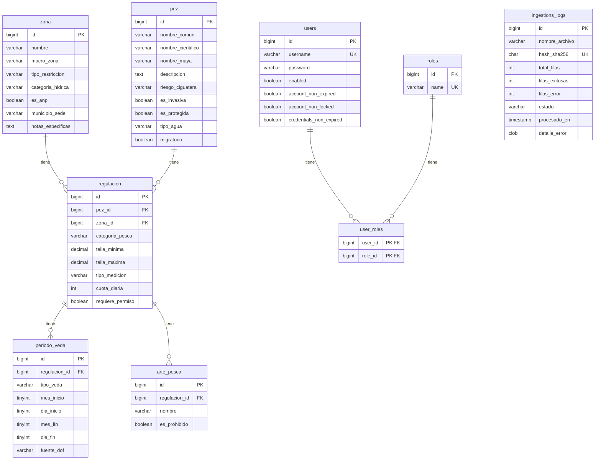

# API Pesca Yucatán

> REST API para gestionar temporadas de vedas y especies marinas en Yucatán, México.

Una aplicación Spring Boot 3.5 que proporciona un catálogo de especies marinas con información técnica, regulaciones de pesca y cierres temporales (vedas), sincronizado automáticamente desde Google Sheets.

## Descripción General

Esta API sirve como backend para la plataforma **Pesca Yucatán**, proporcionando:

- **Catálogo de Especies**: Especies marinas con nombres comunes/científicos en maya, riesgo de ciguatera, invasividad e información de hábitat
- **Zonas Geográficas**: Zonas de pesca organizadas por macro-regiones con restricciones y permisos
- **Regulaciones de Pesca**: Límites de tamaño, cuotas, tipos de medición y permisos requeridos por zona/especie
- **Períodos de Veda**: Prohibiciones de pesca estacionales y plurianuales por regulación
- **Artes de Pesca**: Equipo de pesca permitido y prohibido por regulación
- **Pipeline de Datos Automatizado**: Sincronización diaria desde Google Sheets mediante detección de cambios SHA-256

## Arquitectura

```mermaid
flowchart TD
    subgraph Sources["Fuentes de Datos"]
        GS1[Google Sheets<br/>Especies]
        GS2[Google Sheets<br/>Zonas]
        GS3[Google Sheets<br/>Regulaciones]
        GS4[Google Sheets<br/>Vedas]
        GS5[Google Sheets<br/>Artes de Pesca]
    end

    subgraph Ingestion["Servicio de Ingesta"]
        DL[Descargador CSV]
        H[Hash SHA-256]
        P[Parser CSV]
        UPS[Upsert a BD]
    end

    subgraph Database[(PostgreSQL)]
        T1[pez]
        T2[zona]
        T3[regulacion]
        T4[periodo_veda]
        T5[arte_pesca]
        T6[ingestions_logs]
        T7[users]
        T8[roles]
        T9[user_roles]
    end

    GS1 --> DL
    GS2 --> DL
    GS3 --> DL
    GS4 --> DL
    GS5 --> DL
    DL --> H
    H -->|Sin cambios| SKIP[Omitir]
    H -->|Nuevo contenido| P
    P --> UPS
    UPS --> Database
    Database --> T1
    Database --> T2
    Database --> T3
    Database --> T4
    Database --> T5
    Database --> T6
    Database --> T7
    Database --> T8
    Database --> T9
    SKIP -.->|"Omitir reprocesamiento"| DL
```

## Flujo de Datos

| Etapa | Descripción |
|-------|-------------|
| **Descarga** | Obtiene CSVs desde 5 Google Sheets via HTTP |
| **Deduplicación** | Hash SHA-256 para evitar reprocesar datos sin cambios |
| **Parsing** | Convierte CSV a records Java (EspecieCsvRow, ZonaCsvRow, etc.) |
| **Upsert** | Inserta o actualiza registros en PostgreSQL |
| **Loggeo** | Registra resultados en la tabla ingestion_logs |

## Stack Tecnológico

- **Framework**: Spring Boot 3.5
- **Lenguaje**: Java 21
- **Base de Datos**: PostgreSQL con H2 para desarrollo
- **ORM**: Spring Data JPA / Hibernate
- **Migraciones**: Flyway
- **Seguridad**: Spring Security con autenticación HTTP Basic
- **Build**: Maven

## Primeros Pasos

### Requisitos Previos

- Java 21+
- Maven 3.9+
- PostgreSQL (para producción)

### Compilar y Ejecutar

```bash
# Compilar
./mvnw clean package

# Ejecutar tests
./mvnw test

# Ejecutar aplicación
./mvnw spring-boot:run
```

La API estará disponible en `http://localhost:8080`

### Configuración

Propiedades principales en `application.properties`:

```properties
# Ingesta (programada lunes a las 3 AM)
ingestion.enabled=true
ingestion.cron=0 0 3 * * MON

# URLs de Google Sheets
ingestion.sheets.especies-url=https://docs.google.com/spreadsheets/d/.../export?format=csv&gid=0
ingestion.sheets.zonas-url=https://docs.google.com/spreadsheets/d/.../export?format=csv&gid=1148731082
ingestion.sheets.regulaciones-url=https://docs.google.com/spreadsheets/d/.../export?format=csv&gid=1780368767
ingestion.sheets.periodo-vedas-url=https://docs.google.com/spreadsheets/d/.../export?format=csv&gid=1961121332
ingestion.sheets.arte-pesca-url=https://docs.google.com/spreadsheets/d/.../export?format=csv&gid=1834741829

# CORS
cors.allowed.origins="https://pesca-merida.com","http://localhost:3000","http://localhost:5173"
```

> [!NOTE]
> La consola H2 está habilitada para desarrollo en `http://localhost:8080/h2-console`

## Endpoints de la API

### Especies (Público)

| Método | Endpoint | Descripción |
|--------|----------|-------------|
| `GET` | `/api/v1/peces` | Listar todas las especies |
| `GET` | `/api/v1/peces/{id}` | Obtener especie por ID |
| `POST` | `/api/v1/peces` | Crear especie (ADMIN) |

### Ingesta (Admin)

| Método | Endpoint | Descripción |
|--------|----------|-------------|
| `POST` | `/api/v1/ingestion/trigger` | Trigger manual de ingesta |
| `GET` | `/api/v1/ingestion/status` | Historial de ingesta (últimos 20) |
| `GET` | `/api/v1/ingestion/latest` | Último resultado de ingesta |
| `GET` | `/api/v1/ingestion/stats` | Estadísticas de ingesta |
| `GET` | `/api/v1/ingestion/health` | Health check de ingesta |

### Actuator (Admin)

| Método | Endpoint | Descripción |
|--------|----------|-------------|
| `GET` | `/actuator/health` | Salud de la aplicación (público) |
| `GET` | `/actuator/metrics` | Métricas de la aplicación (ADMIN) |
| `GET` | `/actuator/scheduledtasks` | Información de tareas programadas (ADMIN) |

## Seguridad

La API utiliza autenticación HTTP Basic con acceso basado en roles:

- **Público**: Consultas de especies, health checks
- **ADMIN**: Todos los endpoints de ingesta, creación de especies, métricas, consola H2

Usuarios de desarrollo por defecto (configurados via `DataSeeder`):

| Usuario | Contraseña | Rol |
|---------|------------|-----|
| admin | admin123 | ADMIN |

> [!WARNING]
> Cambiar credenciales antes de desplegar a producción. El seeder solo se ejecuta en la base de datos en memoria H2.

## Estructura del Proyecto

```
src/main/java/com/pescayucatan/api_pesca_merida
├── controller/          # Endpoints REST
├── service/            # Lógica de negocio
├── repository/         # Acceso a datos (Spring Data JPA)
├── model/              # Entidades JPA
├── enums/              # Enumeraciones
├── exception/          # Excepciones personalizadas
├── config/             # Clases de configuración
└── infrastructure/
    └── csv/            # Records para parsing CSV
```

## Esquema de Base de Datos

Migraciones en `src/main/resources/db/migration/`:

- `V1__create_vedas_schema.sql` - Tablas core: `pez`, `zona`, `regulacion`, `periodo_veda`, `arte_pesca`, `ingestions_logs`
- `V2__create_auth_schema.sql` - Tablas de usuario y roles para autenticación: `users`, `roles`, `user_roles`

### Modelo de Datos



## Componentes Futuros

- **Frontend**: React + Vite + TypeScript SPA (ver `FRONTEND_PLAN.md`)

---

Última actualización: 2026-04-07
