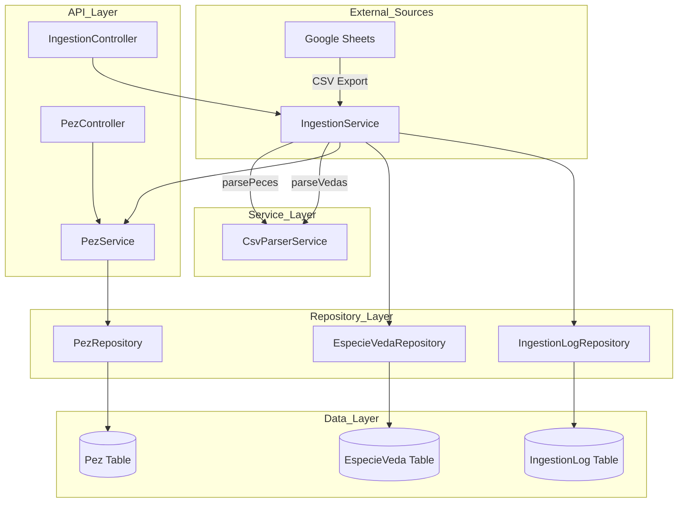
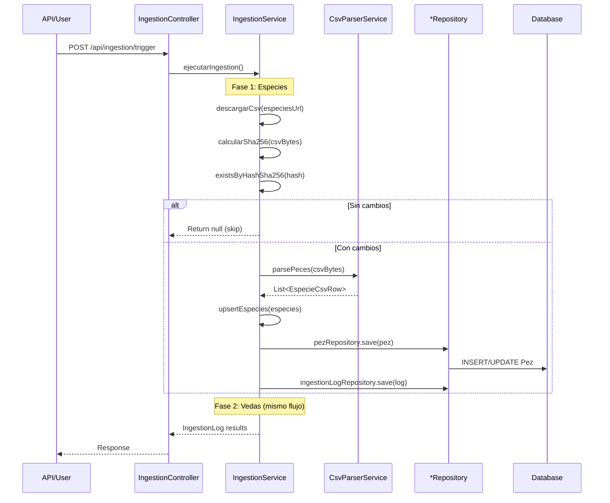
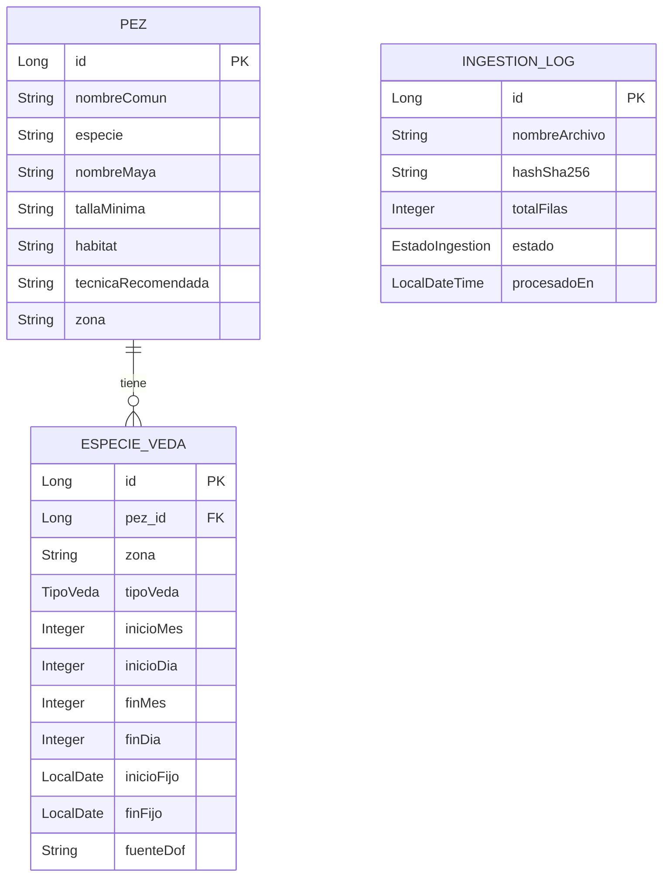
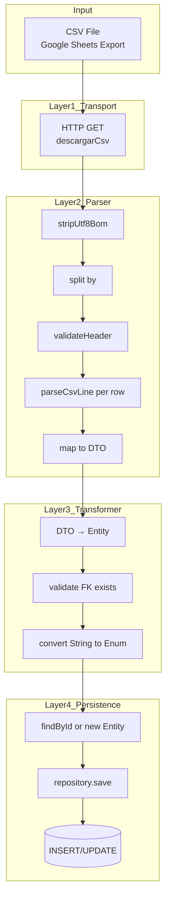
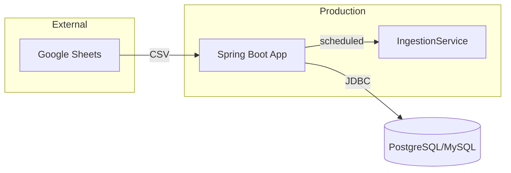

# Project Architecture Blueprint

## 1. Architecture Detection and Analysis

### Technology Stack
- **Framework**: Spring Boot 3.x
- **Language**: Java 17+
- **Build Tool**: Maven
- **Database**: Relational (JPA/Hibernate)
- **API Style**: REST

### Architecture Pattern
This project follows a **Layered Architecture** (Controller-Service-Repository) with clear separation:

```
Controller Layer → Service Layer → Repository Layer → Database
       ↓                                    ↓
   API Input                          Data Access
```

## 2. Architectural Overview

La aplicación implementa una arquitectura RESTful para gestionar datos de pesca deportiva en Yucatán, México. El sistema sigue principios de Clean Architecture con separación de responsabilidades:

- **Controller**: Expone endpoints REST para acceder a datos de especies y vedas
- **Service**: Contiene la lógica de negocio, incluyendo el pipeline de ingesta de datos desde Google Sheets
- **Repository**: Abstrae el acceso a datos usando Spring Data JPA
- **Model**: Entidades JPA que representan las tablas de la base de datos

### Principio Guizante
- **Inversión de Dependencias**: Las capas superiores no dependen de las inferiores
- **Responsabilidad Única**: Cada clase tiene una única razón para cambiar
- **Idempotencia**: La ingesta detecta cambios mediante SHA-256 para evitar reprocesamiento innecesario

## 3. Architecture Visualization

### 3.1 High-Level Architecture



### 3.2 Data Ingestion Flow (CSV → Database)

```mermaid
flowchart LR
    subgraph Phase1_Download
        URL[Google Sheets URL] -->|HTTP GET| DC[descargarCsv]
        DC -->|byte[]| H[Calcular SHA-256]
    end
    
    subgraph Phase2_Parse
        H -->|byte[]| P[parsePeces / parseVedas]
        P -->|List<DTO>| V[Validar y Transformar]
    end
    
    subgraph Phase3_Upsert
        V -->|DTOs| UP[upsertEspecies / upsertVedas]
        UP -->|JPA| REP[Repository.save]
        REP -->|SQL| DB[(Database)]
    end
    
    subgraph Phase4_Log
        UP -->|IngestionLog| LR[ingestionLogRepository.save]
    end
```

### 3.3 Component Interaction - Ingestion Pipeline



## 4. Core Architectural Components

### 4.1 IngestionService (Orquestador Principal)

**Purpose**: Coordinar el flujo completo de ingesta de datos desde Google Sheets

**Responsabilidades**:
1. Descargar CSVs desde URLs configuradas
2. Calcular hash SHA-256 para detección de cambios
3. Verificar idempotencia (evitar reprocesamiento)
4. Orquestar parseo y persistencia
5. Registrar logs de procesamiento

**Ubicación**: `src/main/java/com/pescayucatan/api_pesca_merida/service/IngestionService.java`

**Key Methods**:
- `ejecutarIngestion()` - Método principal orquestador
- `procesarEspecies()` - Pipeline de especies
- `procesarVedas()` - Pipeline de vedas
- `upsertEspecies()` - Persistencia especies
- `upsertVedas()` - Persistencia vedas

### 4.2 CsvParserService (Parser CSV)

**Purpose**: Parsear archivos CSV de Google Sheets a DTOs tipados

**Responsabilidades**:
1. Manejar encoding UTF-8 (incluyendo BOM)
2. Parseo RFC 4180 compliant
3. Validación de headers
4. Transformación a DTOs (EspecieCsvRow, VedaCsvRow)
5. Manejo de errores gracefully

**Ubicación**: `src/main/java/com/pescayucatan/api_pesca_merida/service/CsvParserService.java`

**Key Methods**:
- `parsePeces(byte[])` - Parsear CSV de especies (8 columnas)
- `parseVedas(byte[])` - Parsear CSV de vedas (12 columnas)
- `parseCsvLine(String)` - Parser RFC 4180
- `stripUtf8Bom(byte[])` - Remover Byte Order Mark

### 4.3 CSV DTOs (Data Transfer Objects)

**Purpose**: Representar estructuras de datos del CSV

**Ubicación**: `src/main/java/com/pescayucatan/api_pesca_merida/infrastructure/csv/`

| DTO | Columnas | Propósito |
|-----|----------|-----------|
| `EspecieCsvRow` | 8 | Datos de especies (nombre, especie científica, maya, talla, hábitat, técnica, zona) |
| `VedaCsvRow` | 12 | Datos de vedas (pezId, zona, tipo, fechas, fuente DOF) |

## 5. Data Architecture

### 5.1 Domain Model Structure



### 5.2 Data Flow - CSV to Database



### 5.3 Data Transformation Mapping

#### EspecieCsvRow → Pez Entity

| CSV Column | DTO Field | Entity Field | Transform |
|------------|-----------|--------------|-----------|
| ID | id (Integer) | id (Long) | Integer → Long |
| NOMBRE COMÚN | nombreComun | nombreComun | trim() |
| ESPECIE | especieCientifica | especie | trim() |
| NOMBRE MAYA | nombreMaya | nombreMaya | trim() |
| TALLA MÍNIMA | tallaMinima | tallaMinima | trim() |
| HÁBITAT | habitat | habitat | trim() |
| TÉCNICA RECOMENDADA | tecnicaRecomendada | tecnicaRecomendada | trim() |
| ZONA | zona | zona | trim() |

#### VedaCsvRow → EspecieVeda Entity

| CSV Column | DTO Field | Entity Field | Transform |
|------------|-----------|--------------|-----------|
| Pez ID | pezId (Integer) | pez (Pez FK) | findById() |
| Nombre Común | nombreComun | - | (not stored) |
| Especie | especieCientifica | - | (not stored) |
| Zona | zona | zona | trim() |
| Tipo de Veda | tipoVeda (String) | tipoVeda (Enum) | TipoVeda.fromCsvValue() |
| Inicio mes | inicioMes | inicioMes | parseIntOrNull |
| Inicio día | inicioDia | inicioDia | parseIntOrNull |
| Fin mes | finMes | finMes | parseIntOrNull |
| Fin día | finDia | finDia | parseIntOrNull |
| Inicio fijo | inicioFijo | inicioFijo | isBlank ? null : LocalDate.parse() |
| Fin fijo | finFijo | finFijo | isBlank ? null : LocalDate.parse() |
| Fuente DOF | fuenteDof | fuenteDof | trim() |

## 6. Implementation Patterns

### 6.1 Idempotency Pattern

```java
// IngestionService.java:158-173
private IngestionLog procesarEspecies() {
    // 1. Descargar CSV
    byte[] csvBytes = descargarCsv(especiesUrl);
    
    // 2. Calcular hash
    String hash = calcularSha256(csvBytes);
    
    // 3. Verificar si ya fue procesado (idempotencia)
    if (ingestionLogRepository.existsByHashSha256(hash)) {
        log.info("⏭️  CSV de especies sin cambios (hash: {}...), SKIP", 
                 hash.substring(0, 8));
        return null;  // Skip si ya existe
    }
    
    // 4. Parsear CSV
    List<EspecieCsvRow> especies = csvParser.parsePeces(csvBytes);
    // ... continue processing
}
```

**Pattern**: Detectar cambios usando SHA-256 hash del contenido CSV
**Beneficio**: Evitar reprocesamiento innecesario cuando los datos no cambian

### 6.2 CSV Parser RFC 4180 Compliant

```java
// CsvParserService.java:226-255
private String[] parseCsvLine(String line) {
    List<String> fields = new ArrayList<>();
    StringBuilder currentField = new StringBuilder();
    boolean inQuotes = false;
    
    for (int i = 0; i < line.length(); i++) {
        char c = line.charAt(i);
        
        if (c == '"') {
            // Comillas escapadas ("")
            if (inQuotes && i + 1 < line.length() && line.charAt(i + 1) == '"') {
                currentField.append('"');
                i++; // Skip next quote
            } else {
                inQuotes = !inQuotes;
            }
        } else if (c == ',' && !inQuotes) {
            fields.add(currentField.toString());
            currentField.setLength(0);
        } else {
            currentField.append(c);
        }
    }
    
    fields.add(currentField.toString());
    return fields.toArray(new String[0]);
}
```

**Pattern**: Implementación manual de parser CSV
**Maneja**:
- Campos entre comillas: `"Golfo de México, Zona Norte"`
- Comillas escapadas: `"Técnica ""avanzada"""`
- Campos vacíos: `,,valor,,`

### 6.3 Upsert Pattern

```java
// IngestionService.java:260-292
@Transactional
protected int upsertEspecies(List<EspecieCsvRow> especies) {
    int contador = 0;
    
    for (EspecieCsvRow dto : especies) {
        try {
            // Buscar si ya existe por ID (natural key)
            Pez pez = pezRepository.findById(Long.valueOf(dto.id()))
                    .orElse(new Pez());  // CREATE if not exists
            
            // Mapear DTO → Entity
            pez.setId(Long.valueOf(dto.id()));
            pez.setNombreComun(dto.nombreComun());
            // ... mapping
            
            // Save (Spring decide INSERT o UPDATE)
            pezRepository.save(pez);
            contador++;
            
        } catch (Exception e) {
            log.warn("⚠️  Error procesando especie ID {}: {}", 
                     dto.id(), e.getMessage());
            // Continuar con siguiente (no rompe proceso)
        }
    }
    
    return contador;
}
```

**Pattern**: Find-or-create para UPSERT
**Transaccional**: `@Transactional` para atomicidad

### 6.4 Error Handling Pattern

```java
// CsvParserService.java:56-82
for (int i = 1; i < lines.length; i++) {
    try {
        String[] cols = parseCsvLine(lines[i]);
        
        if (cols.length < 8) {
            log.warn("Fila {} incompleta ({} cols): {}", i + 1, cols.length, lines[i]);
            continue;  // Skip fila inválida
        }
        
        rows.add(new EspecieCsvRow(...));
        
    } catch (Exception e) {
        log.error("Error parseando fila {}: {}", i + 1, e.getMessage());
        // Continúa con siguiente fila (no falla todo el proceso)
    }
}
```

**Pattern**: Fail-gracefully - no falla toda la ingesta por una fila mala
**Logging**: Warnings/errores para auditoría

## 7. Cross-Cutting Concerns

### 7.1 Validation

| Nivel | Validación | Ubicación |
|-------|------------|-----------|
| CSV Header | Verificar columnas esperadas | `CsvParserService.validate*Header()` |
| CSV Rows | Mínimo columnas requeridas | `CsvParserService.parse*()` |
| FK Integrity | Pez debe existir para Veda | `IngestionService.upsertVedas()` |
| Enum Conversion | TipoVeda válido | `TipoVeda.fromCsvValue()` |

### 7.2 Logging

- **Framework**: Lombok `@Slf4j`
- **Niveles**: INFO (progreso), DEBUG (detalles), WARN (filas saltadas), ERROR (fallos)
- **Formato**: Emoji markers para rápida identificación

### 7.3 Configuration

```properties
# application.properties
ingestion.enabled=true
ingestion.cron=0 0 6 * * *  # Daily at 6 AM
ingestion.sheets.especies-url=https://docs.google.com/spreadsheets/d/e/.../export?format=csv&gid=XXX
ingestion.sheets.vedas-url=https://docs.google.com/spreadsheets/d/e/.../export?format=csv&gid=YYY
```

## 8. Extension Points

### 8.1 Adding New CSV Sources

1. **Crear DTO**: Nuevo record en `infrastructure/csv/`
2. **Agregar Parser**: Método en `CsvParserService`
3. **Agregar Pipeline**: Método en `IngestionService`
4. **Configurar**: Agregar URL en `application.properties`

### 8.2 Extending CsvParserService

```java
// Ejemplo para nuevo tipo de CSV
public List<NuevoCsvRow> parseNuevo(byte[] csvBytes) {
    String csvContent = stripUtf8Bom(csvBytes);
    List<NuevoCsvRow> rows = new ArrayList<>();
    String[] lines = csvContent.split("\r?\n");
    
    validateNuevoHeader(lines[0]);  // Nuevo método
    
    for (int i = 1; i < lines.length; i++) {
        String[] cols = parseCsvLine(lines[i]);
        if (cols.length < N) continue;
        
        rows.add(new NuevoCsvRow(...));
    }
    
    return rows;
}
```

### 8.3 Transformation Customization

El patrón de transformación DTO → Entity puede extenderse:
- Agregar campos calculados
- Validaciones adicionales
- Enriquecimiento de datos desde otras fuentes

## 9. Testing Strategy

### Unit Tests
- `CsvParserService`: Test parsing de casos edge (quotes, empty fields, BOM)
- `IngestionService`: Test UPSERT logic (mock repositories)

### Integration Tests
- End-to-end ingestion: Descarga real o mock de CSV, persiste a DB
- API endpoint: `POST /api/ingestion/trigger`

### Test Data Strategies
- CSV samples en `src/test/resources/`
- Mock HTTP responses para Google Sheets

## 10. Deployment Architecture



- **Scheduler**: `@Scheduled(cron)` para ejecución automática
- **Config**: Externalizar URLs de Google Sheets
- **Logging**: Persistido en `IngestionLog` table

## 11. Common Pitfalls

1. **UTF-8 BOM**: Google Sheets a veces incluye BOM - usar `stripUtf8Bom()`
2. **FK Validation**: Vedas sin Pez válido deben skipearse, no fallar
3. **Large Files**: Procesamiento row-by-row evita memory issues
4. **Idempotency**: Siempre calcular hash antes de procesar
5. **Transactions**: `@Transactional` en métodos de persistencia

## 12. Blueprint for New Development

### Adding New Data Source (e.g., Regulations CSV)

1. **Step 1**: Crear DTO en `infrastructure/csv/RegulationCsvRow.java`
2. **Step 2**: Agregar método `parseRegulations()` en `CsvParserService`
3. **Step 3**: Agregar método `procesarRegulations()` en `IngestionService`
4. **Step 4**: Agregar URL en `application.properties`
5. **Step 5**: Crear Entity `Regulation` y Repository si no existe
6. **Step 6**: Agregar UPSERT logic
7. **Step 7**: Testear con CSV real

### Adding New Field to Existing CSV

1. **Step 1**: Agregar campo al DTO (record immutable)
2. **Step 2**: Actualizar parser para leer nueva columna
3. **Step 3**: Actualizar mapping en `upsert*()` método
4. **Step 4**: Agregar columna a Entity si es persistente
5. **Step 5**: Testear con CSV actualizado

---

*Blueprint generado: 2026-04-01*
*Base de análisis: src/main/java/com/pescayucatan/api_pesca_merida/*