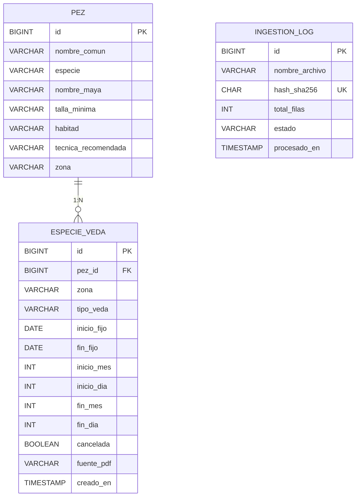
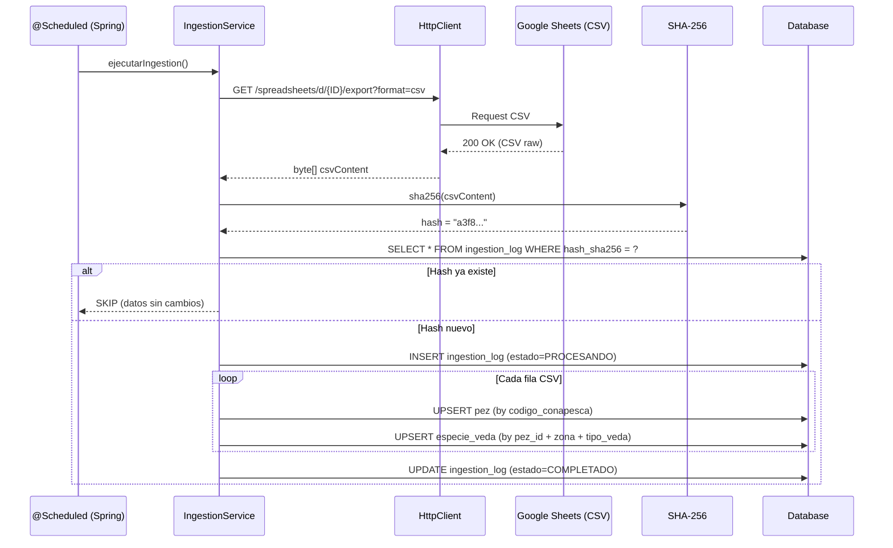
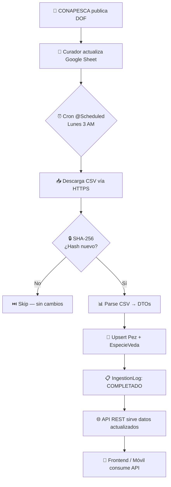

# Estrategia de Ingestión de Datos: CONAPESCA → Spring Boot SQL

> **Fecha**: 2026-03-17  
> **Proyecto**: `api-pesca-merida` (Java 21, Spring Boot 3.5, Flyway, H2/MySQL)  
> **Fuente**: [Google Sheets — Vedas CONAPESCA](https://docs.google.com/spreadsheets/d/1lrzoWe_YgU5S0UULppk8q33CSd26Gu82TiWxerKpqWQ/edit)

---

## 1. Diagnóstico del Estado Actual

### 1.1 Schema Existente



### 1.2 Datos del Google Sheet (30 filas, 12 columnas)

| Columna Sheet | Tipo | Mapeo DB | Notas |
|---|---|---|---|
| `Pez ID` | INT | `pez.id` (lookup) | ID natural de CONAPESCA, **no** auto-increment |
| `Nombre Común` | STRING | `pez.nombre_comun` | Upsert key junto con Especie |
| `Especie Científica` | STRING | `pez.especie` | |
| [Zona](file:///c:/Users/cesar/IdeaProjects/java-spring-boot-fishing-api/src/main/java/com/pescayucatan/api_pesca_merida/model/Pez.java#90-93) | STRING | `especie_veda.zona` | Hasta 80 chars (ajustar VARCHAR) |
| `Tipo de Veda` | ENUM | `especie_veda.tipo_veda` | Requiere mapeo (ver §1.3) |
| `Inicio mes` / `Inicio día` | INT | `inicio_mes` / `inicio_dia` | Null en `PERMANENTE` |
| `Fin mes` / `Fin día` | INT | `fin_mes` / `fin_dia` | Null en `PERMANENTE` |
| `Inicio fijo` / `Fin fijo` | DATE | `inicio_fijo` / `fin_fijo` | Vacío en data actual |
| `Fuente DOF` | STRING | `fuente_pdf` | Renombrar campo a `fuente_dof` |

### 1.3 Desalineación Crítica: [TipoVeda](file:///c:/Users/cesar/IdeaProjects/java-spring-boot-fishing-api/src/main/java/com/pescayucatan/api_pesca_merida/model/EspecieVeda.java#98-101) Enum

| Sheet Value | Enum Java Actual | Acción |
|---|---|---|
| `TEMPORAL FIJA` | `FIJA` | ⚠️ Mapear o renombrar |
| `TEMPORAL VARIABLE` | `CICLICA` | ⚠️ Mapear o renombrar |
| `PERMANENTE` | *(no existe)* | ❌ **Agregar al enum** |
| — | `PLURIANUAL` | Mantener para uso futuro |

> [!WARNING]
> El enum [TipoVeda](file:///c:/Users/cesar/IdeaProjects/java-spring-boot-fishing-api/src/main/java/com/pescayucatan/api_pesca_merida/model/EspecieVeda.java#98-101) actual no tiene `PERMANENTE` y usa nombres distintos a los del Sheet. La migración debe resolver esto antes de cualquier ingestión.

---

## 2. Matriz de Soluciones

### 2.1 Comparativa de Arquitecturas

| Criterio | **A) Apps Script → REST** | **B) CSV Batch Spring** ★ | **C) Python Worker** |
|---|---|---|---|
| **Stack** | JavaScript (GAS) + Java | Java puro | Python + Java |
| **Costo** | $0 | $0 | $0 |
| **Dependencia externa** | Google Apps Script runtime | URL pública del Sheet | Python runtime, `requests` |
| **Trigger** | Time-driven GAS trigger | `@Scheduled` Cron Spring | Cron del OS / GitHub Actions |
| **Latencia de cambios** | ≤ 1 min (push) | Configurable (pull cada N horas) | Configurable |
| **Complejidad de setup** | Media (OAuth scopes, deploy) | **Baja** (0 config externa) | Media (mantener 2 runtimes) |
| **Resiliencia** | Depende de GAS uptime | Autónomo | Depende de env Python |
| **Idempotencia** | Manual (debes implementar) | SHA-256 hash built-in | Manual |
| **Auditoría** | Logs en GAS console | [IngestionLog](file:///c:/Users/cesar/IdeaProjects/java-spring-boot-fishing-api/src/main/java/com/pescayucatan/api_pesca_merida/model/IngestionLog.java#9-115) en DB ✅ | Archivos de log |
| **Encaje con proyecto** | Bajo (código fuera del repo) | **Máximo** (todo en Java) | Medio (ya existe `pdf-extractor/`) |
| **Mantenibilidad** | Baja (2 codebases) | **Alta** (monocodigo) | Media |

### 2.2 Veredicto

> [!IMPORTANT]
> **Arquitectura recomendada: B) CSV Batch con Spring `@Scheduled`**
> 
> **Razones:**
> 1. Cero dependencias externas — solo una URL pública de export CSV.
> 2. Reutiliza [IngestionLog](file:///c:/Users/cesar/IdeaProjects/java-spring-boot-fishing-api/src/main/java/com/pescayucatan/api_pesca_merida/model/IngestionLog.java#9-115) ya modelado en la DB.
> 3. Todo el código vive en el mismo repositorio Java.
> 4. Idempotencia garantizada vía SHA-256 del contenido CSV.
> 5. Costo: $0.

---

## 3. Flujo Técnico Detallado (Arquitectura B)

### 3.1 Diagrama de Secuencia



### 3.2 Stack Técnico (nuevos componentes)

```
src/main/java/com/pescayucatan/api_pesca_merida/
├── config/
│   └── IngestionConfig.java          # @Configuration: URL, cron expression
├── service/
│   ├── IngestionService.java         # Orquestador principal
│   └── CsvParserService.java         # Parseo CSV → DTOs
├── dto/
│   └── VedaCsvRow.java               # Record/POJO para una fila CSV
├── repository/
│   ├── EspecieVedaRepository.java     # JPA repo con custom queries
│   └── IngestionLogRepository.java   # Lookup por hash
└── enums/
    └── TipoVeda.java                 # Actualizado con PERMANENTE + mapeo
```

### 3.3 Implementación Paso a Paso

#### Paso 1: Actualizar [TipoVeda](file:///c:/Users/cesar/IdeaProjects/java-spring-boot-fishing-api/src/main/java/com/pescayucatan/api_pesca_merida/model/EspecieVeda.java#98-101) Enum

```java
public enum TipoVeda {
    TEMPORAL_FIJA,       // Fechas cíclicas anuales fijas
    TEMPORAL_VARIABLE,   // Fechas cíclicas que cambian por DOF
    PERMANENTE,          // Sin fechas, prohibición total
    PLURIANUAL;          // Abarca múltiples años

    /**
     * Mapea el texto del CSV de Google Sheets al enum.
     * Ej: "TEMPORAL FIJA" → TEMPORAL_FIJA
     */
    public static TipoVeda fromCsvValue(String raw) {
        if (raw == null) throw new IllegalArgumentException("TipoVeda null");
        return switch (raw.trim().toUpperCase()) {
            case "TEMPORAL FIJA"     -> TEMPORAL_FIJA;
            case "TEMPORAL VARIABLE" -> TEMPORAL_VARIABLE;
            case "PERMANENTE"        -> PERMANENTE;
            default -> throw new IllegalArgumentException(
                "TipoVeda desconocido: " + raw
            );
        };
    }
}
```

#### Paso 2: Agregar `codigoConapesca` a [Pez](file:///c:/Users/cesar/IdeaProjects/java-spring-boot-fishing-api/src/main/java/com/pescayucatan/api_pesca_merida/model/Pez.java#5-98)

```java
// En Pez.java — nuevo campo para natural key del Sheet
@Column(name = "codigo_conapesca", unique = true)
private Integer codigoConapesca;  // Columna "Pez ID" del Sheet
```

> [!NOTE]
> El `Pez ID` del Sheet (1, 19, 31, 34…) **no** es el auto-increment de la DB. Es un identificador de CONAPESCA que sirve como **natural key** para el upsert.

#### Paso 3: DTO para filas CSV

```java
public record VedaCsvRow(
    Integer pezId,              // "Pez ID"
    String nombreComun,         // "Nombre Común"
    String especieCientifica,   // "Especie Científica"
    String zona,                // "Zona"
    String tipoVeda,            // "Tipo de Veda" (raw string)
    Integer inicioMes,
    Integer inicioDia,
    Integer finMes,
    Integer finDia,
    String inicioFijo,          // Puede estar vacío
    String finFijo,             // Puede estar vacío
    String fuenteDof            // "Fuente DOF"
) {}
```

#### Paso 4: `CsvParserService`

```java
@Service
public class CsvParserService {

    /**
     * Parsea el contenido CSV (UTF-8) en una lista de DTOs.
     * Usa java.io nativo — cero dependencias externas.
     */
    public List<VedaCsvRow> parse(String csvContent) {
        List<VedaCsvRow> rows = new ArrayList<>();
        String[] lines = csvContent.split("\r?\n");
        
        // Skip header (línea 0)
        for (int i = 1; i < lines.length; i++) {
            String[] cols = parseCsvLine(lines[i]); // Maneja comillas
            if (cols.length < 12) continue; // Fila incompleta
            
            rows.add(new VedaCsvRow(
                parseIntOrNull(cols[0]),   // Pez ID
                cols[1].trim(),            // Nombre Común
                cols[2].trim(),            // Especie Científica
                cols[3].trim(),            // Zona
                cols[4].trim(),            // Tipo de Veda
                parseIntOrNull(cols[5]),   // Inicio mes
                parseIntOrNull(cols[6]),   // Inicio día
                parseIntOrNull(cols[7]),   // Fin mes
                parseIntOrNull(cols[8]),   // Fin día
                cols[9].trim(),            // Inicio fijo
                cols[10].trim(),           // Fin fijo
                cols[11].trim()            // Fuente DOF
            ));
        }
        return rows;
    }
    
    private Integer parseIntOrNull(String val) {
        if (val == null || val.isBlank()) return null;
        return Integer.parseInt(val.trim());
    }
    
    // RFC 4180 CSV parser simplificado (maneja comillas en Zona)
    private String[] parseCsvLine(String line) { /* ... */ }
}
```

#### Paso 5: `IngestionService` (Orquestador)

```java
@Service
@Slf4j
public class IngestionService {

    private static final String SHEETS_CSV_URL = 
        "https://docs.google.com/spreadsheets/d/" +
        "1lrzoWe_YgU5S0UULppk8q33CSd26Gu82TiWxerKpqWQ" +
        "/export?format=csv";

    private final CsvParserService csvParser;
    private final PezRepository pezRepo;
    private final EspecieVedaRepository vedaRepo;
    private final IngestionLogRepository logRepo;

    @Scheduled(cron = "0 0 3 * * MON")  // Cada lunes a las 3 AM
    @Transactional
    public void ejecutarIngestion() {
        log.info("⏳ Iniciando ingestión desde Google Sheets...");
        
        // 1. Descargar CSV
        byte[] csvBytes = descargarCsv();
        String csvContent = new String(csvBytes, StandardCharsets.UTF_8);
        
        // 2. Calcular hash → idempotencia
        String hash = sha256(csvBytes);
        if (logRepo.existsByHashSha256(hash)) {
            log.info("✅ CSV sin cambios (hash: {}). Skip.", hash);
            return;
        }
        
        // 3. Crear log entry
        IngestionLog logEntry = crearLogEntry("google-sheets-vedas.csv", hash);
        
        // 4. Parsear y persistir
        List<VedaCsvRow> rows = csvParser.parse(csvContent);
        int exitosas = 0, errores = 0;
        
        for (VedaCsvRow row : rows) {
            try {
                Pez pez = upsertPez(row);
                upsertVeda(pez, row);
                exitosas++;
            } catch (Exception e) {
                errores++;
                log.error("Error fila {}: {}", row.pezId(), e.getMessage());
            }
        }
        
        // 5. Finalizar log
        logEntry.setTotalFilas(rows.size());
        logEntry.setFilasExitosas(exitosas);
        logEntry.setFilasError(errores);
        logEntry.setEstado(errores == 0 
            ? EstadoIngestion.COMPLETADO 
            : EstadoIngestion.ERROR);
        logRepo.save(logEntry);
        
        log.info("✅ Ingestión finalizada: {}/{} exitosas", exitosas, rows.size());
    }
    
    private Pez upsertPez(VedaCsvRow row) {
        return pezRepo
            .findByCodigoConapesca(row.pezId())
            .map(existing -> {
                existing.setNombreComun(row.nombreComun());
                existing.setEspecie(row.especieCientifica());
                return pezRepo.save(existing);
            })
            .orElseGet(() -> {
                Pez nuevo = new Pez();
                nuevo.setCodigoConapesca(row.pezId());
                nuevo.setNombreComun(row.nombreComun());
                nuevo.setEspecie(row.especieCientifica());
                return pezRepo.save(nuevo);
            });
    }

    private void upsertVeda(Pez pez, VedaCsvRow row) {
        TipoVeda tipo = TipoVeda.fromCsvValue(row.tipoVeda());
        
        EspecieVeda veda = vedaRepo
            .findByPezAndZonaAndTipoVeda(pez, row.zona(), tipo)
            .orElseGet(EspecieVeda::new);
        
        veda.setPez(pez);
        veda.setZona(row.zona());
        veda.setTipoVeda(tipo);
        veda.setInicioMes(row.inicioMes());
        veda.setInicioDia(row.inicioDia());
        veda.setFinMes(row.finMes());
        veda.setFinDia(row.finDia());
        veda.setFuentePdf(row.fuenteDof()); // fuente DOF
        
        vedaRepo.save(veda);
    }
}
```

#### Paso 6: Repositorios Nuevos

```java
// EspecieVedaRepository.java
public interface EspecieVedaRepository extends JpaRepository<EspecieVeda, Long> {
    Optional<EspecieVeda> findByPezAndZonaAndTipoVeda(
        Pez pez, String zona, TipoVeda tipoVeda
    );
}

// IngestionLogRepository.java
public interface IngestionLogRepository extends JpaRepository<IngestionLog, Long> {
    boolean existsByHashSha256(String hashSha256);
}

// PezRepository.java (agregar)
Optional<Pez> findByCodigoConapesca(Integer codigoConapesca);
```

#### Paso 7: Flyway Migration `V3`

```sql
-- V3__add_conapesca_code_and_update_tipo_veda.sql

-- 1. Agregar código CONAPESCA como natural key
ALTER TABLE pez ADD COLUMN codigo_conapesca INT UNIQUE;

-- 2. Ampliar zona para nombres largos de CONAPESCA
ALTER TABLE especie_veda ALTER COLUMN zona VARCHAR(200);

-- 3. Renombrar fuente_pdf → fuente_dof (semántica correcta)
ALTER TABLE especie_veda ALTER COLUMN fuente_pdf RENAME TO fuente_dof;

-- 4. Actualizar valores existentes de tipo_veda si los hay
UPDATE especie_veda SET tipo_veda = 'TEMPORAL_FIJA' WHERE tipo_veda = 'FIJA';
UPDATE especie_veda SET tipo_veda = 'TEMPORAL_VARIABLE' WHERE tipo_veda = 'CICLICA';
```

#### Paso 8: Endpoint Manual de Trigger

```java
// IngestionController.java
@RestController
@RequestMapping("/api/v1/ingestion")
public class IngestionController {

    private final IngestionService ingestionService;

    @PostMapping("/trigger")
    public ResponseEntity<String> triggerManual() {
        ingestionService.ejecutarIngestion();
        return ResponseEntity.ok("Ingestión ejecutada");
    }
    
    @GetMapping("/status")
    public ResponseEntity<List<IngestionLog>> status() {
        return ResponseEntity.ok(ingestionLogRepo.findAll());
    }
}
```

---

## 4. Plan de Mantenimiento

### 4.1 Escenarios de Cambio y Respuesta

| Evento | Acción | Automatización |
|---|---|---|
| **CONAPESCA publica nueva veda** | Agregar fila al Sheet | Siguiente ejecución del cron la detecta |
| **Fechas de veda se modifican** | Editar fila en Sheet | Cron detecta hash distinto → upsert actualiza |
| **Veda se cancela** | Marcar `cancelada=true` via API o columna Sheet | Agregar columna "Cancelada" al Sheet |
| **Nueva especie descubierta** | Agregar fila con nuevo `Pez ID` | Auto-crea [Pez](file:///c:/Users/cesar/IdeaProjects/java-spring-boot-fishing-api/src/main/java/com/pescayucatan/api_pesca_merida/model/Pez.java#5-98) + [EspecieVeda](file:///c:/Users/cesar/IdeaProjects/java-spring-boot-fishing-api/src/main/java/com/pescayucatan/api_pesca_merida/model/EspecieVeda.java#9-202) |
| **Cambio de schema (nuevas columnas)** | Nueva migración Flyway `V4+` | Código de parseo se actualiza |
| **Sheet URL cambia** | Actualizar [application.properties](file:///c:/Users/cesar/IdeaProjects/java-spring-boot-fishing-api/src/main/resources/application.properties) | Sin recompilación (externalizado) |

### 4.2 Configuración Externalizada

```properties
# application.properties
ingestion.sheets.url=https://docs.google.com/spreadsheets/d/1lrz.../export?format=csv
ingestion.cron=0 0 3 * * MON
ingestion.enabled=true
```

```java
@Configuration
@ConfigurationProperties(prefix = "ingestion")
public class IngestionConfig {
    private String sheetsUrl;
    private String cron;
    private boolean enabled;
    // getters/setters
}
```

### 4.3 Monitoreo

| Mecanismo | Implementación |
|---|---|
| **Log de auditoría** | [IngestionLog](file:///c:/Users/cesar/IdeaProjects/java-spring-boot-fishing-api/src/main/java/com/pescayucatan/api_pesca_merida/model/IngestionLog.java#9-115) con conteo de filas exitosas/error |
| **Health check** | Spring Actuator `/actuator/health` |
| **Alertas** | Si `filas_error > 0`, log `WARN` |
| **Dashboard** | `GET /api/v1/ingestion/status` retorna historial |

### 4.4 Ciclo de Vida del Dato



---

## 5. Checklist de Implementación

| # | Tarea | Prioridad | Estado |
|---|---|---|---|
| 1 | Actualizar enum [TipoVeda](file:///c:/Users/cesar/IdeaProjects/java-spring-boot-fishing-api/src/main/java/com/pescayucatan/api_pesca_merida/model/EspecieVeda.java#98-101) (agregar `PERMANENTE`, renombrar valores) | 🔴 Alta | ⬜ |
| 2 | Agregar `codigoConapesca` a modelo [Pez](file:///c:/Users/cesar/IdeaProjects/java-spring-boot-fishing-api/src/main/java/com/pescayucatan/api_pesca_merida/model/Pez.java#5-98) | 🔴 Alta | ⬜ |
| 3 | Crear migración Flyway `V3` | 🔴 Alta | ⬜ |
| 4 | Crear `VedaCsvRow` record/DTO | 🟡 Media | ⬜ |
| 5 | Implementar `CsvParserService` | 🟡 Media | ⬜ |
| 6 | Crear `EspecieVedaRepository` + `IngestionLogRepository` | 🟡 Media | ⬜ |
| 7 | Actualizar `PezRepository` con `findByCodigoConapesca` | 🟡 Media | ⬜ |
| 8 | Implementar `IngestionService` (orquestador) | 🔴 Alta | ⬜ |
| 9 | Crear `IngestionController` (trigger manual + status) | 🟢 Baja | ⬜ |
| 10 | Configurar [application.properties](file:///c:/Users/cesar/IdeaProjects/java-spring-boot-fishing-api/src/main/resources/application.properties) (URL, cron) | 🟢 Baja | ⬜ |
| 11 | Ampliar VARCHAR de `zona` en schema (30 → 200) | 🔴 Alta | ⬜ |
| 12 | Tests unitarios para `CsvParserService` | 🟡 Media | ⬜ |
| 13 | Test de integración end-to-end con H2 | 🟡 Media | ⬜ |

---

## 6. Análisis de Riesgos

| Riesgo | Impacto | Mitigación |
|---|---|---|
| Google cambia formato de export CSV | 🔴 Alto | Validar header antes de parsear; test de humo contra URL real |
| Sheet se hace privado accidentalmente | 🔴 Alto | Monitorear HTTP status; alertar si ≠ 200 |
| Datos duplicados por race condition | 🟡 Medio | `@Transactional` + unique constraints en DB |
| CSV con encoding roto (BOM, Latin-1) | 🟡 Medio | Forzar UTF-8; strip BOM bytes |
| CONAPESCA cambia el `Pez ID` de una especie | 🔴 Alto | Log warning si `nombre_comun` != lo almacenado para ese ID |
| Zona excede VARCHAR | 🟡 Medio | Migración V3 extiende a 200; validar en parseo |

> [!CAUTION]
> La URL de export CSV de Google Sheets **no tiene SLA**. Si el Sheet se borra o cambia permisos, la ingestión falla silenciosamente. El sistema debe alertar (`filas_error == total_filas`) y tener un fallback de carga manual vía `POST /api/v1/ingestion/upload-csv`.
